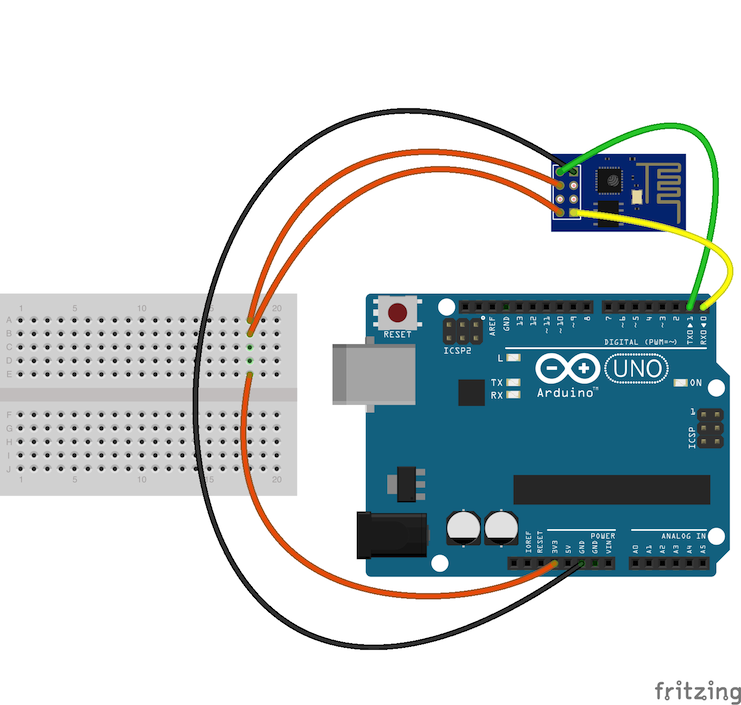

# Balcony plant irrigation system

Balcony automated watering system powered by arduino, esp8266 and node-red via MQTT.

## Wiring scheme



## Arduino Uno code

```c++
#include <Servo.h>
int servoPin = 10;
char recstr[5] = ""; //Initialized variable to store recieved data
char oValve[5] = "valv0";
char cValve[5] = "valv1";

Servo servo;

void closeValve()
{
  servo.write(10);
}

void openValve()
{
  servo.write(80);
}

void setup() {
  Serial.begin(115200);
  Serial.flush();
  servo.attach(servoPin);
}

void loop() {
  Serial.readBytes(recstr, 5); //Read the serial data and store in var

  if (strncmp(recstr, cValve, 5) == 0) {
    closeValve();
  }
  if (strncmp(recstr, oValve, 5) == 0) {
    openValve();
  }
  Serial.println(recstr);
  delay(1000);
}
```

## ESP8266 code

```c++
#include <ESP8266WiFi.h>
#include <PubSubClient.h>

const char* ssid = "ssid";
const char* password =  "password";
//const char* mqttServer = "ip";
const char* mqttServer = "192.168.1.250";
//const int mqttPort = 5100;
const int mqttPort = 1883;
const char* mqttUser = "";
const char* mqttPassword = "";

WiFiClient espClient;
PubSubClient client(espClient);

long lastMsg = 0;
char msg[50];
int value = 0;
char mystr[] = "Hello"; //String data
char recstr[5]; //Initialized variable to store recieved data

void setup_wifi() {

  delay(10);
  // We start by connecting to a WiFi network
  Serial.println();
  Serial.print("Connecting to ");
  Serial.println(ssid);

  WiFi.begin(ssid, password);

  while (WiFi.status() != WL_CONNECTED) {
    delay(500);
    Serial.print(".");
  }

  randomSeed(micros());

  Serial.println("");
  Serial.println("WiFi connected");
  Serial.println("IP address: ");
  Serial.println(WiFi.localIP());
}

void callback(char* topic, byte* payload, unsigned int length) {
  for (int i = 0; i < length; i++) {
    //Serial.print((char)payload[i]);
  }

  // Switch on the LED if an 1 was received as first character
  if ((char)payload[0] == '1') {
    digitalWrite(BUILTIN_LED, LOW);   // Turn the LED on (Note that LOW is the voltage level
    // but actually the LED is on; this is because
    // it is acive low on the ESP-01)
    char mystr[] = "valv1"; //String data

    Serial.write(mystr,5); //Write the serial data
  } else {
    digitalWrite(BUILTIN_LED, HIGH);  // Turn the LED off by making the voltage HIGH
    char mystr[] = "valv0"; //String data
    Serial.write(mystr,5); //Write the serial data
  }

}

void reconnect() {
  // Loop until we're reconnected
  while (!client.connected()) {
    Serial.print("Attempting MQTT connection...");
    // Create a random client ID
    String clientId = "balkon-esp-1";
    // Attempt to connect
    if (client.connect(clientId.c_str())) {
      Serial.println("connected");
      // Once connected, publish an announcement...
      client.publish("balkon/valve", "valve turned: ");
      // ... and resubscribe
      client.subscribe("balkon/valve");
    } else {
      Serial.print("failed, rc=");
      Serial.print(client.state());
      Serial.println(" try again in 5 seconds");
      // Wait 5 seconds before retrying
      delay(5000);
    }
  }
}

void setup() {
  pinMode(BUILTIN_LED, OUTPUT);     // Initialize the BUILTIN_LED pin as an output
  Serial.begin(115200);
  
  setup_wifi();
  client.setServer(mqttServer, mqttPort);
  client.setCallback(callback);
}

void loop() {
  if (!client.connected()) {
    reconnect();
  }
  client.loop();

  long now = millis();
  if (now - lastMsg > 2000) {
    lastMsg = now;
    ++value;
  }
}

```
